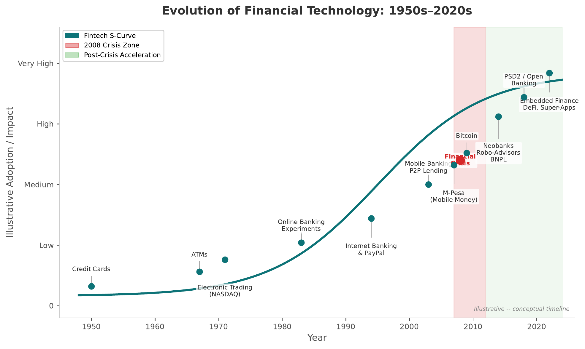

# AGENTS.md — Lecture HTML Pages

<!-- Parent: ../AGENTS.md -->

## Directory Overview

The **lectures/** directory contains self-contained, single-file HTML pages (~2200+ lines each) that deliver lecture content with rich interactivity, mathematical rendering, and responsive design. Each lecture is a complete, standalone HTML document with inline CSS and JavaScript—no dependencies except CDN-delivered fonts and KaTeX math library.

### Purpose

Present lecture content in an editorial, web-native format with chart visualizations, mathematical notation, scroll tracking, and responsive mobile-first design. Pages are designed for readability on desktop and tablet, with smooth scrolling and semantic structure.

### Key Features

- Single-file HTML pages (no separate assets except images and CDN libraries)
- Inline CSS with 2000+ line design systems per page
- KaTeX integration for mathematical formula rendering
- Sticky scroll tracking sidebar with section navigation
- 12 embedded chart PNG images per lecture
- Fully responsive design: mobile-first (375px) to desktop (1120px+)
- Semantic HTML5 structure with proper heading hierarchy
- High-contrast color scheme for accessibility

## Files & Structure

### L01.html — Fintech Foundations and Overview

**Lecture 1 content page (~2200+ lines)**

**Title**: "L01: Fintech Foundations and Overview"

**Content Sections** (8 main sections):

1. **Opening Section** — Hero intro with cartoon/graphic
2. **What is Fintech?** — Definition, scope, evolution
3. **Key Concepts** — Core terminology and taxonomy
4. **Fintech Evolution Timeline** — Historical progression from 2008 onwards
5. **Banking Value Chain Disruption** — How fintech impacts traditional banking
6. **Fintech Investment Growth** — Market statistics and trends
7. **Bank-Fintech Partnership Models** — Collaboration frameworks
8. **Closing Section** — Summary and key takeaways with cartoon/graphic

**Embedded Assets**:
- 12 chart PNG images (located in `../charts/L01/`)
- Opening and closing cartoons
- Inline SVG shapes for visual hierarchy

**Special Features**:
- Sidebar with sticky scroll tracking (desktop only, hidden on mobile)
- Section anchor links (#section-id) for direct navigation
- KaTeX math rendering for financial formulas
- Responsive image gallery grid within content

### L02.html — Fintech Ecosystem

**Lecture 2 content page (~2200+ lines)**

**Title**: "L02: Fintech Ecosystem"

**Content Sections** (8 main sections):

1. **Opening Section** — Hero intro with cartoon
2. **Fintech Ecosystem Overview** — Market structure, players, roles
3. **Growth Drivers** — What accelerates fintech adoption
4. **Financial Inclusion & Access** — Geography, demographics, barriers
5. **Technology & Adoption Lifecycle** — How new tech gets adopted
6. **Behavioral Economics & Choice Architecture** — Nudging, decision frameworks
7. **Regulation & Trust** — Frameworks, compliance, consumer protection
8. **Closing Section** — Ecosystem impact and future outlook

**Embedded Assets**:
- 12 chart PNG images (located in `../charts/L02/`)
- Opening and closing cartoons
- Inline SVG shapes for visual hierarchy

**Special Features**:
- Sidebar with sticky scroll tracking (desktop, hidden on mobile)
- Color-coded callout boxes (Info, Callout, Alert, Success)
- KaTeX math rendering for statistical models
- Embedded tables with complex data

## HTML Structure

Both L01.html and L02.html follow the same structural template:

```html
<!DOCTYPE html>
<html lang="en">
<head>
  <!-- Meta tags, fonts, KaTeX, style -->
</head>
<body>
  <!-- Navigation bar (sticky) -->
  <nav class="nav">...</nav>

  <!-- Hero section -->
  <section class="hero">...</section>

  <!-- Main content wrapper -->
  <div class="container">
    <!-- Sidebar (sticky scroll tracking) -->
    <aside class="sidebar">
      <nav class="toc"><!-- Table of contents --></nav>
    </aside>

    <!-- Main content area -->
    <main class="main-content">
      <!-- 8 content sections, each with id="section-N" -->
      <section id="section-1">...</section>
      <section id="section-2">...</section>
      <!-- ... -->
    </main>
  </div>

  <!-- Scroll tracking script, KaTeX rendering -->
  <script>...</script>
</body>
</html>
```

## Design System

### CSS Variables (Root Scope)

Defined in `<style>` block within `<head>`:

```css
:root {
  /* Brand */
  --nav-bg:        #1a1a4e;
  --hero-from:     #0D7377;
  --hero-to:       #14BDEB;
  --accent:        #FF7F0E;
  --accent-light:  #FFB347;
  --module-green:  #2CA02C;

  /* Neutrals */
  --ink:           #1a1d23;
  --ink-muted:     #4a5568;
  --ink-subtle:    #718096;
  --border:        #e2e8f0;
  --border-light:  #f1f5f9;
  --surface:       #ffffff;
  --surface-soft:  #f8fafc;
  --surface-tint:  #eef7f8;

  /* Semantic (callout boxes, alerts) */
  --info-bg:       #e0f4f5;
  --info-border:   #0D7377;
  --callout-bg:    #fff3e0;
  --callout-border: #FF7F0E;
  --alert-bg:      #fef2f2;
  --alert-border:  #dc2626;
  --success-bg:    #f0fdf4;
  --success-border: #2CA02C;

  /* Layout */
  --sidebar-w:     240px;
  --content-max:   860px;
  --nav-h:         56px;

  /* Typography */
  --font-display:  'Crimson Pro', Georgia, serif;
  --font-body:     'Source Sans 3', -apple-system, BlinkMacSystemFont, 'Segoe UI', sans-serif;
  --font-mono:     'JetBrains Mono', 'Courier New', monospace;
}
```

All color, spacing, and typography values are parameterized. To update the theme globally, edit these variables once.

### Typography

| Use | Font | Weight | Size |
|-----|------|--------|------|
| Page title (h1) | Crimson Pro | 600–700 | 2.4–2.6rem |
| Section heading (h2) | Crimson Pro | 600 | 1.8rem |
| Subsection (h3) | Crimson Pro | 600 | 1.3rem |
| Body text | Source Sans 3 | 400–500 | 1rem |
| Small text (captions) | Source Sans 3 | 400 | 0.85rem |
| Code/math | JetBrains Mono | 400 | 0.9rem |

### Callout Boxes

Four semantic callout styles, each with background and left border:

| Type | Class | Colors | Use |
|------|-------|--------|-----|
| Info | `.callout-info` | #e0f4f5 bg, #0D7377 border | Key definitions, explanations |
| Callout | `.callout` | #fff3e0 bg, #FF7F0E border | Important notes, highlights |
| Alert | `.callout-alert` | #fef2f2 bg, #dc2626 border | Warnings, caveats |
| Success | `.callout-success` | #f0fdf4 bg, #2CA02C border | Key achievements, completed items |

### Responsive Breakpoints

| Breakpoint | Width | Behavior |
|------------|-------|----------|
| Mobile | 375–599px | Single column, sidebar hidden, full-width content |
| Tablet | 600–1023px | Single column, sidebar hidden or minimal |
| Desktop | 1024px+ | Two-column layout, sidebar sticky on left |

Max content width: 860px (readable column width for editorial content).

## KaTeX Math Rendering

### Setup

KaTeX is loaded from CDN in `<head>`:

```html
<link rel="stylesheet" href="https://cdn.jsdelivr.net/npm/katex@0.16.10/dist/katex.min.css" />
<script defer src="https://cdn.jsdelivr.net/npm/katex@0.16.10/dist/katex.min.js"></script>
<script defer src="https://cdn.jsdelivr.net/npm/katex@0.16.10/dist/contrib/auto-render.min.js"
  onload="renderMathInElement(document.body, {
    delimiters: [
      {left:'$$',right:'$$',display:true},
      {left:'$',right:'$',display:false}
    ]
  });"></script>
```

### Usage

- **Inline math**: `$formula$` (e.g., `$F = P(1 + r)^n$`)
- **Display math**: `$$formula$$` (centered block, on own line)

KaTeX auto-renders on page load. Check browser console for rendering errors if formulas don't display.

## Scroll Tracking Sidebar

### HTML Structure

```html
<aside class="sidebar">
  <nav class="toc">
    <div class="toc-header">On this page</div>
    <ul class="toc-list">
      <li><a href="#section-1">Section 1 Title</a></li>
      <li><a href="#section-2">Section 2 Title</a></li>
      <!-- ... -->
    </ul>
  </nav>
</aside>
```

### JavaScript Behavior

- As user scrolls, active section updates in sidebar
- Active link highlighted with `.active` class (text-color change, visual cue)
- Sidebar remains sticky at top on desktop (position: sticky)
- Sidebar hidden on mobile via `display: none` in media query

### Implementation

```javascript
const sectionLinks = document.querySelectorAll('.toc-list a');
const sections = document.querySelectorAll('section[id^="section-"]');

window.addEventListener('scroll', () => {
  let current = '';
  sections.forEach((section) => {
    const sectionTop = section.offsetTop;
    if (pageYOffset >= sectionTop - 50) {
      current = section.getAttribute('id');
    }
  });

  sectionLinks.forEach((link) => {
    link.classList.remove('active');
    if (link.getAttribute('href').slice(1) === current) {
      link.classList.add('active');
    }
  });
});
```

## Chart Images

### Location & Naming

All chart PNG images located in `../charts/L01/` or `../charts/L02/`. Naming convention: `snake_case.png` (e.g., `fintech_evolution_timeline.png`).

### Embedding in HTML

```html
<figure class="chart-figure">
  
  <figcaption>Figure 1: Fintech Evolution Timeline. Source: Lecture slides.</figcaption>
</figure>
```

### Properties

- Use `<figure>` + `<figcaption>` for semantic structure
- Always include descriptive `alt` text for accessibility
- Use `loading="lazy"` for performance (deferred image loading)
- Charts are PNG, not SVG (raster from PDF conversion)
- Responsive sizing: `max-width: 100%`, adjust via CSS media queries

### Image Count

- L01: 12 charts (opening cartoon, 10 content charts, closing cartoon)
- L02: 12 charts (opening cartoon, 10 content charts, closing cartoon)

## Common Tasks

### Adding a New Content Section

1. In the HTML, add new `<section id="section-N">` after the last section
2. Add corresponding TOC link in `.toc-list`: `<li><a href="#section-N">New Section Title</a></li>`
3. Include charts, text, callout boxes as needed
4. Update the scroll tracking script if sidebar changes (unlikely)

### Embedding a New Chart

1. Place PNG in `../charts/L01/` or `../charts/L02/`
2. In HTML, add:
```html
<figure class="chart-figure">
  
  <figcaption>Figure N: Chart Title. Source: ...</figcaption>
</figure>
```
3. Test responsive sizing on mobile/tablet (image should scale with viewport)

### Updating Color Scheme

1. Edit `:root { --variable-name: new-value; }` in `<style>` block
2. All elements referencing that variable update automatically
3. No HTML changes needed

### Adding Math Formulas

Use KaTeX inline or display syntax:
- Inline: `The formula is $F = P(1 + r)^n$ for compound interest.`
- Display:
```html
$$F = P(1 + r)^n$$
```

KaTeX auto-renders on page load. Complex formulas may need manual escaping (check KaTeX docs).

### Making Responsive Adjustments

Look for `@media (max-width: 768px)` blocks in CSS. Key responsive changes:
- Sidebar hidden on mobile (`display: none`)
- Content width adjusted (padding increases)
- Font sizes may reduce (use `clamp()` for fluid sizing)
- Chart images scale to 100% width with max-width constraint

## Testing Checklist

- [ ] Page loads without errors (check browser console)
- [ ] KaTeX formulas render correctly (math appears, not raw LaTeX)
- [ ] All 12 chart images load (no 404 or broken image icons)
- [ ] Scroll tracking sidebar works (active section highlights as you scroll)
- [ ] Images are lazy-loaded (use DevTools Network tab to verify)
- [ ] Responsive design: test at 375px, 768px, 1120px
- [ ] Color contrast meets WCAG AA (use WebAIM Contrast Checker)
- [ ] All internal links work (e.g., nav links, sidebar TOC)
- [ ] Navigation bar is sticky (stays at top when scrolling)
- [ ] Callout boxes styled correctly (background, border, text color)

## AI Agent Instructions

### Designer / Frontend Developer

- **Focus**: Typography, responsive layout, visual hierarchy, accessibility
- **Key tasks**: Update CSS variables, adjust breakpoints, verify color contrast
- **DO**: Inline all CSS. Test on real mobile devices or DevTools. Use semantic HTML.
- **AVOID**: External stylesheets. Inline all CSS in `<style>` block. No frameworks.

### Content Writer / Editor

- **Focus**: Section text, callout clarity, math formula accuracy, figure captions
- **Key tasks**: Edit section content, verify KaTeX rendering, check image alt text
- **DO**: Keep section structure intact. Update only content within `<section>` tags.
- **AVOID**: Changing CSS or page layout. Verify KaTeX formulas render before committing.

### QA / Testing

- **Focus**: Responsive design, math rendering, image loading, scroll tracking
- **Key tasks**: Test on multiple devices, verify KaTeX, check chart images load
- **DO**: Use browser DevTools, test actual devices, check console for errors
- **AVOID**: Assuming things work—always test visually and programmatically.

## Related Documentation

- **Parent**: `../AGENTS.md` — Overview of entire website
- **Charts**: `../charts/AGENTS.md` — Chart image organization and naming
- **Galleries**: `../galleries/AGENTS.md` — Slide gallery pages (similar structure)
- **Quizzes**: `../quizzes/AGENTS.md` — Quiz pages and question format
- **Source**: `../../lectures/L01/` and `../../lectures/L02/` — Original slide materials
